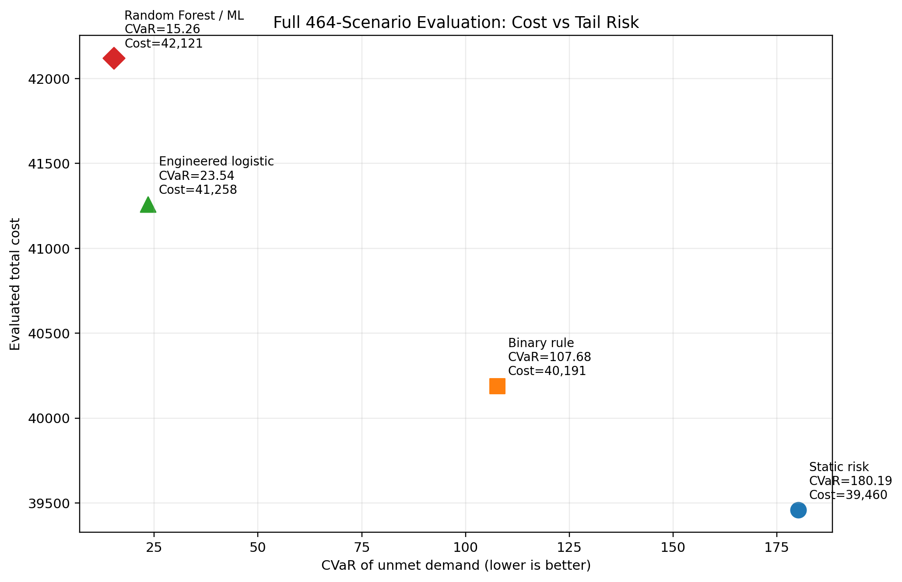
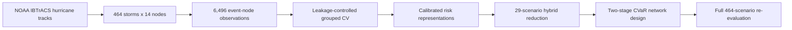

# Do Complex Machine-Learning Risk Models Improve Hurricane-Resilient Supply Chain Design?

[](https://github.com/Evelyn-R7/hurricane-resilient-supply-chain/actions/workflows/validate.yml)
[](LICENSE)

**A comparative decision study of hurricane exposure risk representations**

This research project examines whether more complex hurricane-risk models improve downstream supply-chain network decisions. It combines leakage-controlled machine learning, scenario reduction, and a two-stage stochastic mixed-integer optimization model with Conditional Value-at-Risk (CVaR).

> **Scope:** the prediction target is a hurricane **hazard-exposure proxy**, not observed firm shutdown or verified operational disruption. The network is a geographically grounded, 14-node stylized testbed rather than a proprietary company network.



## Research question

When hurricane-track data are available but real operational-failure labels are not, which risk representation is most useful for resilient network design?

The study compares six representations:

1. global fixed risk;
2. node-level historical risk;
3. coastal/inland group risk;
4. binary scenario-conditioned exposure rules;
5. calibrated engineered logistic probabilities;
6. calibrated Random Forest probabilities (ML Dynamic).

## Pipeline



## Main findings

- The dataset contains **464 North Atlantic hurricane events**, **14 supply-chain nodes**, and **6,496 event-node observations**. The 200 km / 50 kt exposure proxy produces **160 positive observations (2.46%)**.
- The calibrated Random Forest improves rare-event ranking over the strong engineered logistic baseline (average precision **0.799 vs 0.687** in the conference rerun).
- Under full 464-scenario Random-Forest-calibrated evaluation, the lowest CVaR of unmet demand is **180.19** for static designs, **107.68** for the binary rule design, **23.54** for engineered-logistic designs, and **15.26** for ML-derived designs.
- The lower tail risk is not free: the representative ML design raises evaluated cost from **39,460** for the static design to **42,121**. The result is a cost-tail-risk trade-off, not unconditional dominance.
- The 29-scenario hybrid set retains about **31.0%** of weighted predicted-risk mass, compared with **6.2%** for the mean random 29-scenario subset, while retaining all top-10 total-risk scenarios.

The broader conclusion is that the largest decision gain comes from moving beyond static risk toward **scenario-conditioned probabilistic risk**. Nonlinear ML adds value over an interpretable probability model, but the gain must be judged against its additional complexity and cost.

## Repository contents

| File / folder | Purpose |
|---|---|
| `notebooks/` | Narrative research notebooks with saved tables, figures, interpretation, and conclusions |
| `src/hurricane_resilience/` | Reusable data, feature, modeling, scenario, optimization, evaluation, and plotting implementation |
| `scripts/run_full_pipeline.py` | Command-line entry point for validation and optional ordered notebook execution |
| `tests/` | Lightweight regression tests for data loading, CVaR, and scenario weights |
| `results/figures/` | Curated figures aligned with the latest manuscript framing |
| `results/tables/` | Current result tables used by the public project summary |
| `DATA_SOURCES.md` | Data provenance, attribution, citation, checksum, and redistribution notes |
| `THIRD_PARTY_NOTICES.md` | Scope of the MIT License and third-party terms |
| `CITATION.cff` | GitHub-compatible citation metadata for this research repository |
| `START_HERE_CN.md` | Chinese handoff guide for publishing with Codex |
| `REPRODUCIBILITY.md` | Full and solver-free reproduction routes |
| `scripts/validate_repository.py` | Lightweight repository and notebook validation |
| root-level CSV files | Curated processed inputs required to inspect or reproduce the published workflow |

## Recommended run order

The notebook numbers reflect the research history. For a clean full rerun, use this order:

1. Read `notebooks/01_data_and_ml_pipeline.ipynb` for data construction, prediction, calibration, and scenario construction.
2. Read `notebooks/04_interpretable_baselines_and_scenario_checks.ipynb` for the interpretable baselines and scenario diagnostics needed by the comparison.
3. Read `notebooks/02_optimization_and_evaluation.ipynb` for the two-stage CVaR model, Pareto designs, and full-scenario evaluation.
4. Read `notebooks/03_robustness_and_sensitivity.ipynb` for temporal, threshold, scenario, and parameter robustness checks.

Launch Jupyter from the repository root. Each notebook resolves the project root with `pathlib`, adds `src/` to its import path, and uses project-relative data and output paths:

```bash
jupyter lab
```

The notebooks load saved result tables when possible. Recomputing optimization outputs requires a working Gurobi installation and license.

## Command-line reproduction

Install the package in editable mode, run tests, and validate the curated public results without recomputing them:

```bash
pip install -e .
python -m unittest discover -s tests
python scripts/run_full_pipeline.py
```

To execute all four notebooks in the approved order, explicitly acknowledge the Gurobi requirement:

```bash
python scripts/run_full_pipeline.py --execute-notebooks --allow-gurobi
```

This second route may invoke licensed optimization solves. The default command deliberately validates the published artifacts without overwriting or recomputing approved research results.

## Python package structure

```text
src/hurricane_resilience/
├── data.py             # CSV/IBTrACS and event-node data access
├── features.py         # feature/target construction
├── risk_models.py      # preprocessing, model families, calibration metrics
├── scenarios.py        # scenario reduction and weight validation
├── optimization.py     # Gurobi availability, settings, input contracts
├── evaluation.py       # weighted CVaR and nondominated-front extraction
├── visualization.py    # consistent project-relative figure output
└── paths.py            # pathlib-based repository paths
```

## Installation

```bash
python -m venv .venv
# Windows: .venv\Scripts\activate
# macOS/Linux: source .venv/bin/activate
pip install -r requirements.txt
```

The original environment was not exported as a lock file, so the dependency ranges in `requirements.txt` are compatibility-oriented rather than an exact historical snapshot. After a successful full rerun, create a pinned environment file for archival reproducibility.

## Data source and attribution

The underlying hurricane-track data come from the **International Best Track Archive for Climate Stewardship (IBTrACS)**, maintained by the **NOAA National Centers for Environmental Information (NCEI)**.

- **Dataset:** International Best Track Archive for Climate Stewardship (IBTrACS)
- **Release:** Version 4r01
- **Subset:** North Atlantic basin (`NA`)
- **Provider:** NOAA National Centers for Environmental Information
- **Dataset DOI:** [`10.25921/82ty-9e16`](https://doi.org/10.25921/82ty-9e16)
- **Official access page:** [NOAA/NCEI IBTrACS](https://www.ncei.noaa.gov/products/international-best-track-archive)
- **Recorded source-file date:** May 29, 2026 (from the archived local file metadata)
- **Archived raw-file SHA-256:** `9df93cf1908027c18c0d7ffd701bf62870bb71254a833f6ebec567f2cc87dd75`

The original raw CSV is intentionally **not redistributed** in this repository. Open the official NOAA/NCEI access page, choose Version 4r01 CSV data and the North Atlantic (`NA`) basin subset, then save the downloaded file as `ibtracs_NA.csv` in the repository root. Run `notebooks/01_data_and_ml_pipeline.ipynb` to rebuild the event-node data. The checksum above identifies the exact archived source file, even though it is not published here.

The project filters and transforms the public storm-track records into an event-node dataset for a 14-node stylized supply-chain network. The exposure label is constructed from storm-to-node distance and wind-speed thresholds; it is a physical hazard proxy rather than an observed business-disruption label.

See [`DATA_SOURCES.md`](DATA_SOURCES.md) for the full provenance statement and recommended citations.

## Recommended IBTrACS citation

Gahtan, J., K. R. Knapp, C. J. Schreck, H. J. Diamond, J. P. Kossin, and M. C. Kruk (2024). *International Best Track Archive for Climate Stewardship (IBTrACS) Project, Version 4r01, North Atlantic subset*. NOAA National Centers for Environmental Information. https://doi.org/10.25921/82ty-9e16. Accessed May 29, 2026 (date recorded from the archived source-file metadata).

Knapp, K. R., M. C. Kruk, D. H. Levinson, H. J. Diamond, and C. J. Neumann (2010). “The International Best Track Archive for Climate Stewardship (IBTrACS): Unifying Tropical Cyclone Best Track Data.” *Bulletin of the American Meteorological Society*, 91, 363–376. https://doi.org/10.1175/2009BAMS2755.1.

## Limitations

- The label is a physical exposure proxy rather than observed operational failure.
- The network is stylized and contains 14 nodes.
- The optimization abstracts from correlated node failures, explicit arc disruption, demand surge, and multistage adaptation.
- The reduced 29-scenario set is validated through diagnostics and full-scenario re-evaluation, but it is not claimed to reproduce the exact full-scenario Pareto frontier.
- Full optimization reproduction requires commercial solver software or an academic Gurobi license.

## Project status

Research code and working-paper results. The latest public-facing interpretation follows the comparative decision-study framing rather than the earlier claim that ML designs unconditionally dominate simpler baselines.

## Repository validation

A lightweight validation script checks that required files exist, notebook JSON is valid, notebook code cells compile, the raw IBTrACS CSV is not committed, and obvious local absolute paths are absent:

```bash
python scripts/validate_repository.py
```

The same check runs automatically through GitHub Actions after the repository is published.

## License

Original code and documentation authored for this project are released under the [MIT License](LICENSE).

The MIT License does **not** relicense NOAA/NCEI IBTrACS data, Gurobi, Python dependencies, or any other third-party material. Those resources remain governed by their original providers' licenses and terms. See [THIRD_PARTY_NOTICES.md](THIRD_PARTY_NOTICES.md) and [DATA_SOURCES.md](DATA_SOURCES.md) for scope, attribution, citations, and access instructions.
